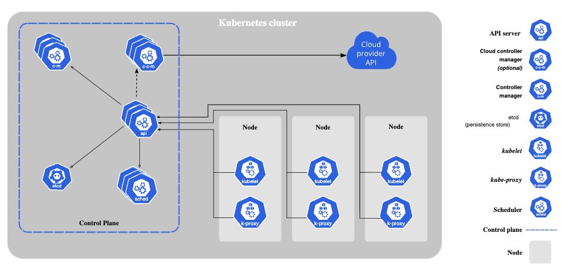

# Introduction
We are trying to learn kubernetes by asking question and answering them.

### What is a kubernetes?
Kubernetes is an open source container orchestration engine for automating deployment, scaling, and management of containerized applications.

### What is the kubernetes core working principle to achive the orchestration?
Kubernetes ask us what state you we want, realize these request as an `object` state and kubernetes continuously work on maintaining the request state. 

### How we request or tell, what state we want?
We write kubernetes API, we express our request in .yaml format.

```yaml
apiVersion: apps/v1
kind: Deployment
metadata:
  name: nginx-deployment
spec:
  selector:
    matchLabels:
      app: nginx
  replicas: 2 # tells deployment to run 2 pods matching the template
  template:
    metadata:
      labels:
        app: nginx
    spec:
      containers:
      - name: nginx
        image: nginx:1.14.2
        ports:
        - containerPort: 80
```

### What will kubernetes do with our API request?
Kubernetes creates `objects`, Kubernetes objects are persistent entities in the Kubernetes system. Kubernetes uses these entities to represent the state of your cluster.

### What are the different Object Kinds, kubernetes understand?
1. Pods
2. Replica Sets
3. Services
4. Volumes
5. Name Spaces
6. ConfigMaps and Secrets
7. Stateful Sets
8. Daemon Sets

### Why kubernetes are called k8's?
Entire kubernetes working depends on or modeled around 8 kubernetes kind offered. 

### How does kubernetes achive the orchestration?
The kubectl command-line tool supports several different ways to create and manage Kubernetes objects.

### How does kubernetes maintain the object state requested?
An application state is requested as an object to kubernetes using API, Kubernetes recieves the request and maintain the state in a cluster. It is a Master and Worker node architecture, control plane act as a master and corresponding nodes act as workers with pods in it. <br />



### How these Objects are identified?
Each object in your cluster has a Name that is unique for that type of resource. Every Kubernetes object also has a UID that is unique across your whole cluster. (eg name: nginx-demo )

```yaml
apiVersion: v1
kind: Pod
metadata:
  name: nginx-demo
spec:
  containers:
  - name: nginx
    image: nginx:1.14.2
    ports:
    - containerPort: 80
```

### How can we group these Objects and refer when needed?
We use labels and selectors to group name them and refer them as group.
Labels - they are key/value pairs that are attached to objects such as Pods.
```yaml
apiVersion: v1
kind: Pod
metadata:
  name: label-demo
  labels:
    environment: production
    app: nginx
spec:
  containers:
  - name: nginx
    image: nginx:1.14.2
    ports:
    - containerPort: 80
```