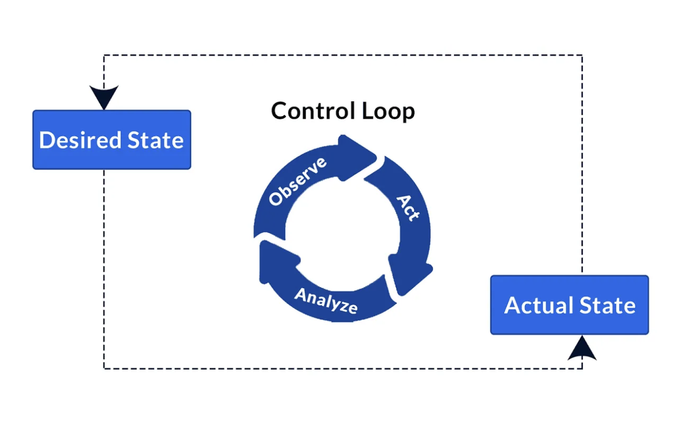

# Introduction
This chapter is an introduction to kubernetes and we understand the basics of Kubernets. We are try to understand kubernetes basics, by asking question and answering them.

### What is a kubernentes?
Kubernetes is an open source container orchestration engine for automating deployment, scaling, and management of containerized applications.

### Why Kubernetes are called k8's?
Kubernetes is often abbreviated as "K8s" because of a common practice in the tech community to shorten long words by replacing the middle characters with their count. In the case of Kubernetes, the abbreviation "K8s" comes from:

The letter "K" at the beginning.
The letter "s" at the end.
The number "8" in the middle, representing the eight letters between "K" and "s".
So, "K" + 8 characters + "s" becomes "K8s".

This form of abbreviation is known as "numeronym," where numbers are used to simplify the representation of long words. It's a shorthand way to reference Kubernetes in written communication, making it quicker to write and easier to recognize.

### Where is this containeriszed application hosted?
Contanerized applications are hosted in kubernetes clusters.

### What is a Kubernetes Cluster?
A Kubernetes cluster is a set of nodes that run containerized applications managed by Kubernetes. It consists of at least one master node (control plane) and multiple worker nodes where the actual applications run. The master node is responsible for managing the cluster, while the worker nodes are where the applications and services are deployed and run.


### What are the major components of Kubernetes cluster?

Kubernetes components are classified as Control plane compoanents and Node components.

Control plane components consists of
* kube-apiserver
* etcd
* kube-scheduler
* kube-controller-manager
* cloud-controller-manager

Node Components consist of
* kubelet
* kube-proxy
* Container runtime

### What are Addons in kubernetes?
Add-ons extend the functionality of Kubernetes. Special listed Addons nare

* DNS
* Web UI (Dashboard)
* Container Resource Monitoring
* Cluster-level Logging
* Network Plugins

### How kubernetes work?

Kubernetes ask us about the desired state of the application and Kubernetes being a controller fleet, a control loop that watches the state of our cluster, then make changes to move the current state closer to the desired state.

 

### How we let kubernetes know, what state we want?

Kubernetees understand what state we want from the objects created. 

### What is an Object?
Kubernetes objects are persistent entities in the Kubernetes system and it is used to represent the state of our cluster.
Each Object has a Object `spec` (describe desired state) and Object `status` (describes current state).

### How these Objects are created?
Objects are created based on the `record of intent` provided.

### How `record of intent` is created?
By using `manifest` file we declare our `record of intent` to create an object.

### What is a manifest?
A "manifest" is a specific file or set of files (typically written in YAML or JSON) that users create to declare the desired state of a Kubernetes resource.

### Give a sample `manifest` file?
```yaml
apiVersion: apps/v1
kind: Deployment
metadata:
  name: nginx-deployment
spec:
  replicas: 3
  selector:
    matchLabels:
      app: nginx
  template:
    metadata:
      labels:
        app: nginx
    spec:
      containers:
      - name: nginx
        image: nginx:1.14.2
        ports:
        - containerPort: 80

```
### What is the difference between "record of intent" and "manifest"?
`manifest` are collection of files, where `record of intent` is declared.

### Does kubernetes stores the manifest files?
Kubernetes does not store the manifest files themselves, but it stores the state information represented by those manifests. When you submit a manifest to the Kubernetes API server, the desired state defined in the manifest is processed and stored in etcd, the distributed key-value store used by Kubernetes for all its data.

### Where are the objects stored?
Kubernetes stores the serialized state of objects by writing them into etcd.

### What is an etcd?
`etcd` is an open source distributed key-value store used to hold and manage the critical information that distributed systems need to keep running.

* Replicated
* Consistent
* Highly available
* Fast
* Secure

Kubernetes etcd stores state data, configuration data and meta data. `etcd` has a wait frunction which continiously monitor config and state, will notify kubernetes when there is a difference.

### What are the different Object Kinds, kubernetes understand?
* Pods
* Replica Sets
* Services
* Volumes
* Namespaces
* ConfigMaps and Secrets
* Stateful Sets
* Daemon Sets

### How kubernetes Identifies the Objects?
Each object in your cluster has a Name that is unique for that type of resource. Every Kubernetes object also has a UID that is unique across your whole cluster.

### How can we identify the Objects?
Each object in your cluster has a Name that is unique for that type of resource. Every Kubernetes object also has a UID that is unique across your whole cluster. (eg name: nginx-demo )

```yaml
apiVersion: v1
kind: Pod
metadata:
  name: nginx-demo
spec:
  containers:
  - name: nginx
    image: nginx:1.14.2
    ports:
    - containerPort: 80
```

### How can we group these Objects and refer when needed?
We use labels and selectors to group name them and refer them as group. Labels - they are key/value pairs that are attached to objects such as Pods.

```yaml
apiVersion: v1
kind: Pod
metadata:
  name: label-demo
  labels:
    environment: production
    app: nginx
spec:
  containers:
  - name: nginx
    image: nginx:1.14.2
    ports:
    - containerPort: 80
```

### What are these kubernetes Objects used for?
Objects are used to create the resources of desired state for running application in kubernetes. Resources are the fundemental building blocks of kubernentes, and they describe the various entities that make up a kubernetes application and infrastructure.

### What are applications running in kubernetes called?
Applications running in kubernetes are called workloads.

### How Kubernetes isolates Kubernetes process with applicaton process?
Kubernetes uses `namespaces` provide a mechanism for isolating Kubernetes process with applicaton process. The `namespaces` provide a mechanism for isolating groups of resources within a cluster. Kubernetes creates below namespaces for the Kubernets operations
* default                       
* kube-public            
* kube-system            

## Conclusion
We coverd the basics of kubernetes and major components of kubernetes.