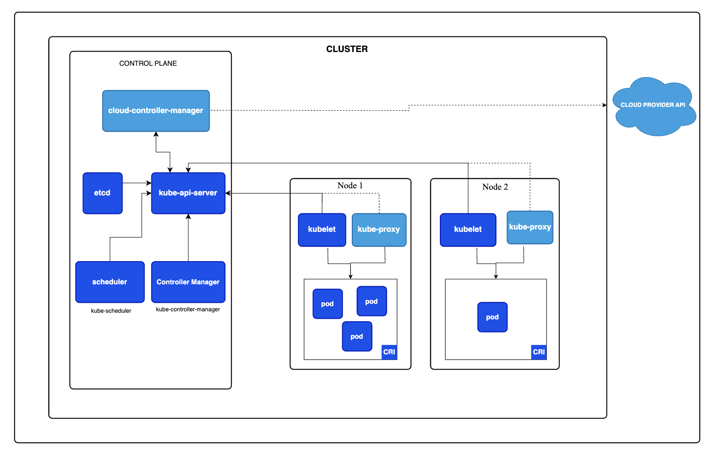

# Introduction 
Last chapter we gone have through the kubernetes basics, now lets try to deep dive into kubernets architecture.

### What are application running in kubernetes called?
Application running in kubernetes are called `workloads`.

### Where does the `workloads` run in Kubenetes?
Workloads run in POD's.

### What is a POD?
Pods are the smallest deployable units of computing that you can create and manage in Kubernetes. They are similar to a set of containers with shared namespaces and shared filesystem volumes.

### Which OS does POD have?
Kubernetes supports two operating system for POD, linux and windows. `.spec.os.name` field indicate the OS on which you want the pod to run. 

### Where does the POD run?
Pods run on the NODES of the cluster.

### Who manages the NODES?
Each NODES are manged by Control plane.

### What is a control plane?
The container orchestration layer that exposes the API and interfaces to define, deploy, and manage the lifecycle of containers.

### How does control plane knows about NODES?
NODES need to get added to API server in control plane, its done in two ways.
1. The kubelet on a node self-registers to the control plane
2. You (or another human user) manually add a Node object

### What are the major components of NODE?
The components on a NODE include the kubelet, a container runtime, and the kube-proxy.

### What is kubelet?
The kubelet is the primary "node agent" that runs on each node. It can register the node with the apiserver using one of: the hostname; a flag to override the hostname; or specific logic for a cloud provider.

### What are the primary objectives of Kubelet?
Kubelet is in charge of executing pod requirements, managing resources, and guaranteeing cluster health.

### What is a cluster in kubernetes?
A cluster is a set of nodes (physical or virtual machines) running Kubernetes agents, managed by the control plane.

 

## Conclusion
