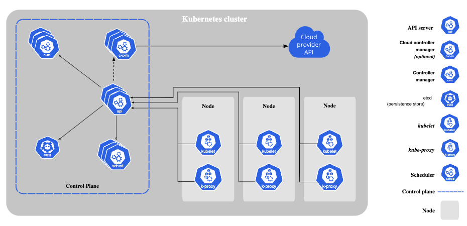

# Introduction 
Last chapter we gone have through the kubernetes basics, now lets try to deep dive into kubernets architecture.

### What are application running in kubernetes called?
Application running in kubernetes are called `workloads`.

### Where does the `workloads` run in Kubenetes?
Workloads run in POD's.

### What is a POD?
Pods are the smallest deployable units of computing that you can create and manage in Kubernetes. They are similar to a set of containers with shared namespaces and shared filesystem volumes.

### Which OS does POD have?
Kubernetes supports two operating system for POD, linux and windows. `.spec.os.name` field indicate the OS on which you want the pod to run. 

### Where does the POD run?
Pods run on the NODES of the cluster.

### Who manages the NODES?
Each NODES are manged by Control plane.

### How nodes are identified?
Every `node` is idetenfied with a unique name, two nodes cannot have same name at the same time.

### Why two nodes cannot have same name at the same time?
Because, Kubernetes assumes that a resource with the same name is the same `object`.

### What is a control plane?
The container orchestration layer that exposes the API and interfaces to define, deploy, and manage the lifecycle of containers.

### How does control plane knows about NODES?
NODES need to get added to API server in control plane, its done in two ways.
1. The kubelet on a node self-registers to the control plane
2. You (or another human user) manually add a Node object

### What are the major components of NODE?
The components on a NODE include the kubelet, a container runtime, and the kube-proxy.

### What is kubelet?
The kubelet is the primary "node agent" that runs on each node. It can register the node with the apiserver using one of: the hostname; a flag to override the hostname; or specific logic for a cloud provider.

### What are the primary objectives of Kubelet?
Kubelet is in charge of executing pod requirements, managing resources, and guaranteeing cluster health.

### What you call all these kubernetes componente combinedly?
We call it kubernetes cluster.

### What is a Kubernetes Cluster?
A Kubernetes cluster is a set of nodes that run containerized applications managed by Kubernetes. It consists of at least one master node (control plane) and multiple worker nodes where the actual applications run. The master node is responsible for managing the cluster, while the worker nodes are where the applications and services are deployed and run.

### What are the major components of Kubernetes cluster?
Kubernetes components are classified as Control plane compoanents and Node components.

Control plane components consists of
* kube-apiserver
* etcd
* kube-scheduler
* kube-controller-manager
* cloud-controller-manager

Node Components consist of
* kubelet
* kube-proxy
* Container runtime

### What are Addons in kubernetes?
Add-ons extend the functionality of Kubernetes. Special listed Addons nare

* DNS
* Web UI (Dashboard)
* Container Resource Monitoring
* Cluster-level Logging
* Network Plugins

### How to communicate with the kubernetes control plane?
Kubernetes provides a command line tool named 'kubectl' for communicating with a Kubernetes cluster's control plane, using the Kubernetes API.

### What is kubectl?
The Kubernetes command-line tool, kubectl, allows you to run commands against Kubernetes clusters.

### What is the biggest challenge in managing individual pods?
Our workloads run on a container in POD and when POD fails we need to get it back for the workload. Managing individual PODS like this will be challenging, kubernets solves this by `workload objects`.

### What is a `workload objects`?
A `workload object` that represents a higher abstraction level than a Pod, and then the Kubernetes control plane automatically manages Pod objects on our behalf, based on the specification for the `workload object` we defined.
> Kubernetes provide built in API to create `workload object`.

### What are the different `workload objects` available in Kubernetes?
* Deployments
* StatefulSet
* DaemonSet
* Job

### 
## Conclusion
We covered the basic Kubernetes architecture and understood where our applications are actually running.